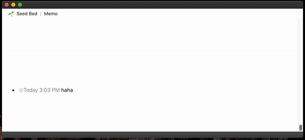
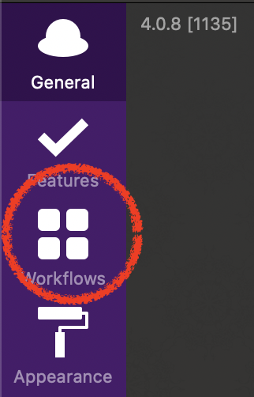
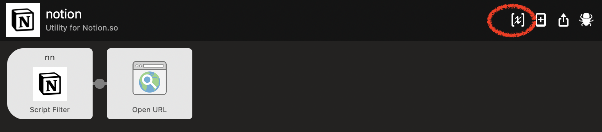
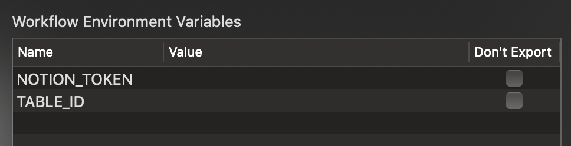
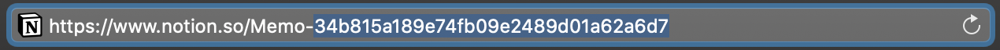
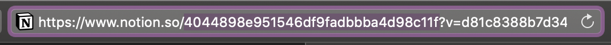
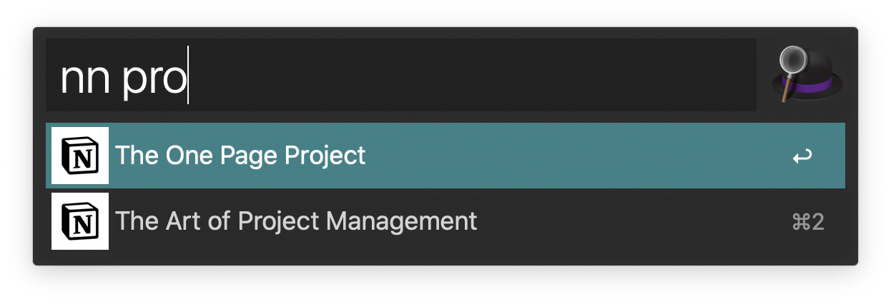

# alfred-notion

[Alfred](https://www.alfredapp.com) workflow for searching or taking a note with [notion.so](https://notion.so).




## How to use

1. Installing `alfred-notion` will import this workflow as automatically.

```bash
$ npm i -g alfred-notion

> alfred-notion@1.0.2 postinstall /Users/kson/.nvm/versions/node/v10.14.2/lib/node_modules/alfred-notion
> alfy-init

+ alfred-notion@1.0.2
added 228 packages from 83 contributors in 10.859s
```

2. Set environment variables to address your notion.so 

<details>
<summary>Go to Preference,</summary>







</details>

----

<details>
<summary>Get your token,</summary>
<a href="https://github.com/dragonman225/notionapi-agent/blob/master/documentation/get-token/get-token.md">See this</a>
</details>

----

<details>
<summary>Get your quick note(seedbed) id,</summary>


</details>

----

<details>
<summary>And get your table id</summary>


</details>

----

3. Search your notion table



4. Take a quick note


