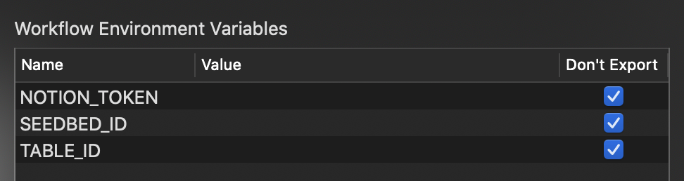

# alfred-notion

[Alfred](https://www.alfredapp.com) workflow to search from a table of [notion.so](https://notion.so).

## How to use

1. Installing `alfred-notion` will import this workflow as automatically.

```bash
$ npm i -g alfred-notion

> alfred-notion@1.0.2 postinstall /Users/kson/.nvm/versions/node/v10.14.2/lib/node_modules/alfred-notion
> alfy-init

+ alfred-notion@1.0.2
added 228 packages from 83 contributors in 10.859s
```

2. Set environment variables to address your notion.so 

<details>
<summary>Go to Preference,</summary>




</details>


[Get your token](https://github.com/dragonman225/notionapi-agent/blob/master/documentation/get-token/get-token.md),

<details>
<summary>And get your table id</summary>


</details>

3. Search your notion table


